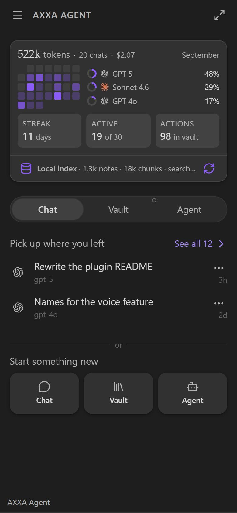
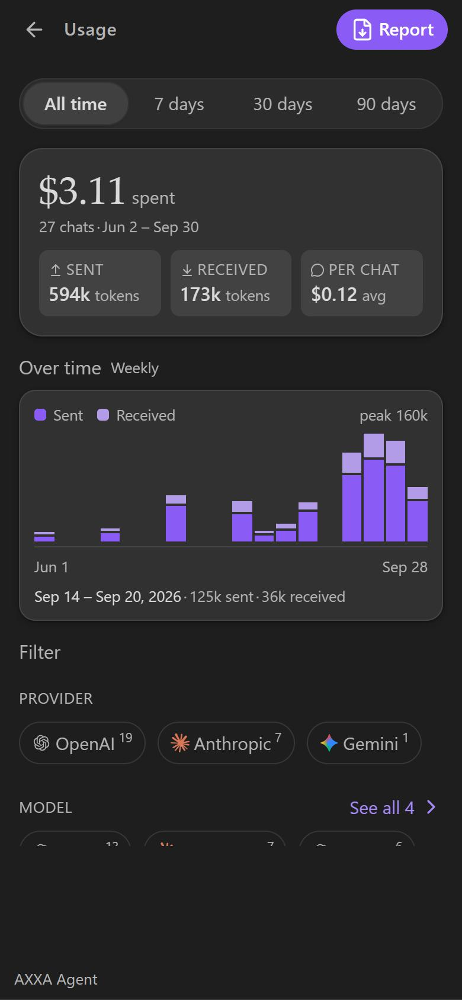
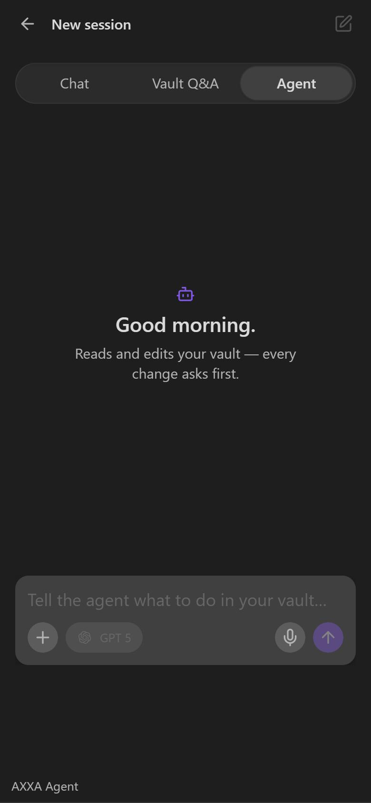
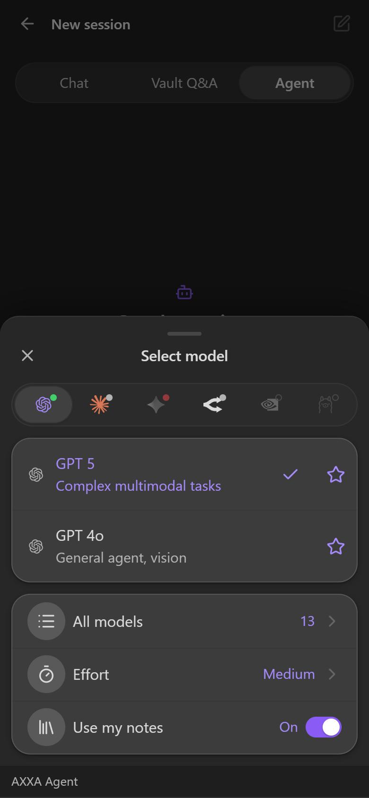
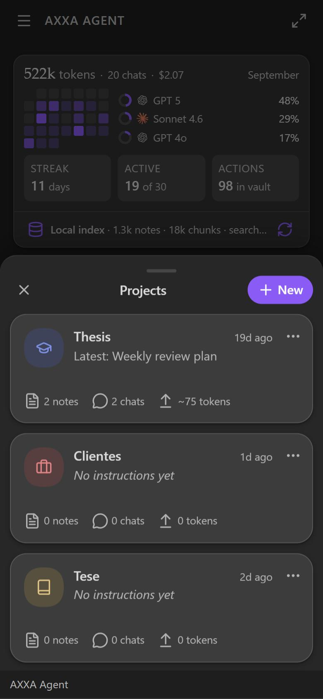
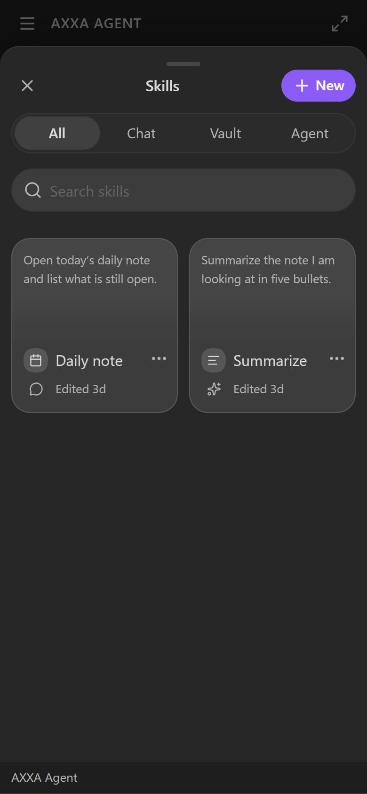
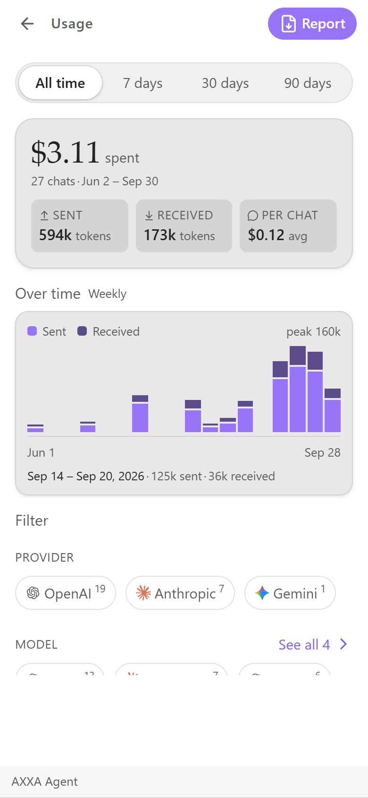

# AXXA Agent

> **Your AI workspace, native to Obsidian.** Chat, ask your vault, and let an agent act on your notes — across 6 LLM providers, with your own API keys. Mobile-first.

> **Install it from inside Obsidian:** Settings → Community plugins → Browse →
> search **AXXA Agent**. Free, and everything in this release stays free.

AXXA Agent turns Obsidian into a full AI workspace. It feels like a native feature, not a bolted-on panel: a chat lives in the right sidebar (a drawer on mobile), talks to the model of your choice, and — when you let it — reads, searches, and edits the notes in your vault. Bring your own keys, pick any of six providers, and keep every conversation as plain Markdown inside your vault.

> 🇧🇷 **Versão em português** mais abaixo → [Pular para PT-BR](#-axxa-agent-português).

---

## ✨ Highlights

- **A tenth of the size.** `main.js` is **425 KB** (136 KB gzipped). The whole
  plugin — six providers, local RAG, an agent with tools, voice, image
  generation — fits in less than half a megabyte.
- **3 modes, one panel** — Chat, Vault Q&A (RAG over your notes), and Agent
  (tool-calling on your files).
- **6 providers, bring your own key** — OpenAI, Anthropic, Google Gemini,
  OpenRouter, Nvidia NIM, and local Ollama. Switch freely; your keys go to your
  OS keychain, never to `data.json` and never to us.
- **Talk to your vault** — local semantic search with hybrid keyword + vector
  ranking and wikilink-graph awareness. 8 embedding models across 4 providers,
  free options included.
- **An agent that acts** — create, read, edit, move and delete notes through a
  permissioned tool layer. Deletes go to your trash, moves rewrite your
  `[[links]]`, and destructive actions always ask first.
- **Projects and Skills** — group chats around a set of notes and instructions;
  save prompts as `.md` files that become slash-commands.
- **Real cost tracking** — spend in USD by provider, model, mode and day, with a
  chart of tokens over time and a report you can save as a note.
- **Everything is Markdown** — chats, skills and generated media are `.md` files
  in your vault. Portable, versionable, yours.
- **Mobile-first** — designed for the Obsidian mobile drawer *first*, not ported
  to it: keyboard-aware layout, edge-to-edge composer, hold-to-record audio,
  haptics, optional fullscreen.

### 📸 Screenshots

| Home | Usage & cost | Agent |
|---|---|---|
|  |  |  |

| Model picker | Projects | Skills |
|---|---|---|
|  |  |  |

---

## 💰 Pricing: this release is free. All of it. Forever.

**Every feature you can see in this app today is free, with no tier, no account
and no license key — and it stays that way.** Nothing listed above or shown in
those screenshots will ever move behind a paywall.

If paid options appear later, they will be **new, additional** things built on
top — never a lock placed on something that already worked for free. You bring
your own API keys and pay your provider directly; the plugin takes no cut and
has no hosted service in the middle.

---

## 🎯 Built like a product, not a panel

Most AI plugins for this ecosystem ship somewhere between **4 and 5 MB** of
JavaScript. This one is **425 KB** — under half a megabyte, with six providers,
local RAG, an agent with tools, voice and image generation inside it.

That number is not a bragging right, it is a constraint that shaped everything:

- **Obsidian Sync refuses any single file over 5 MB.** A plugin that sits a few
  kilobytes under that ceiling has nowhere left to grow. This one sits at 8% of
  it.
- **On a phone, size is startup time.** That megabyte is parsed on every single
  launch, on hardware far slower than the laptop it was built on.
- **Nothing here loads before the app does.** Registration happens on load; the
  index, the model cache and the skills are read after Obsidian's interface is
  already on screen.

### The interface is the feature

This is not a chat box bolted onto a sidebar. Every screen was drawn, measured
and corrected against the real Obsidian stylesheet, on a 375-pixel phone, in
both themes:

- **Designed phone-first, not ported.** The composer tracks the software
  keyboard as it opens; sheets resize with it; there is an optional fullscreen
  mode that hands the whole screen to the conversation.
- **Contrast is measured, not eyeballed.** Every text and icon was composited
  over its real translucent background and checked against WCAG — 4.5:1 for
  text, 3:1 for icons — in light and dark.
- **One vocabulary everywhere.** The same card, the same sheet, the same pill,
  the same proportion ring. Model names read the way you say them ("Sonnet 4.6",
  not `claude-sonnet-4-6`).
- **It uses your theme.** Every colour is a mix of Obsidian's own variables, so
  the plugin inherits whatever theme and accent you already chose, instead of
  painting its own brand over your vault.
- **Empty states do their job.** No screen ever just disappears; it stays and
  says why it is empty.

Everything above is in the screenshots. None of it is a mockup.

---

## 🔒 Privacy & local-first

AXXA Agent is built for the Obsidian ethos — **your notes are yours**.

- **Everything stays in your vault.** Chats, generated media, and skills are plain `.md` files on disk. Nothing is uploaded to us.
- **No telemetry, no tracking, no accounts.** The plugin phones home to *nobody*. The only network calls are the ones you trigger to the LLM provider you chose (with your own key).
- **Bring your own key — keys never leave your device.** They live in your OS keychain (secure storage), used only to call the provider you picked.
- **Works fully offline with Ollama.** Run local models with zero data leaving your machine — chat, RAG, and the agent all work air-gapped.
- **Cite & open your notes.** Vault answers cite the source notes as clickable `[[wikilinks]]` that open the real note.

> Start free, no credit card: Gemini's free tier, OpenRouter's free models, or local Ollama.

---

## 🚀 Installation

### From Obsidian (recommended, once published)

1. Open **Settings → Community plugins**.
2. Make sure **Restricted mode** is off.
3. Click **Browse**, search for **AXXA Agent**, and install.
4. **Enable** the plugin. Open it from the ribbon icon or the command palette (**"AXXA Agent: Open"**).

### Manual installation

1. Download `main.js`, `manifest.json`, and `styles.css` from the [latest release](../../releases).
2. Copy them into your vault at `<vault>/.obsidian/plugins/axxa-agent/`.
3. Reload Obsidian and enable the plugin in **Settings → Community plugins**.

> **Requires** Obsidian **1.11.4+** (for OS-level secret storage of API keys). Works on desktop and mobile.

---

## ⚡ Quick start

1. Open the plugin and go to **Settings → Providers**.
2. Pick a provider and paste your API key (see the [provider table](#-providers) for where to get one). Ollama needs only a local endpoint — no key.
3. Open a new chat: choose **provider → model → mode → effort** on the starter screen.
4. Type and send. Your conversation is saved automatically as Markdown in your vault.

That's it. The first message **locks** the provider, model, and mode for that conversation, so a chat stays consistent end-to-end. New settings apply to new chats.

---

## 🧠 The three modes

| Mode | What it does |
|---|---|
| **Chat** | Classic conversational AI with streaming responses, Markdown rendering, and code blocks with copy buttons. No vault access. |
| **Vault Q&A** | Retrieval-augmented chat grounded in *your* notes. Local semantic search finds the relevant passages and feeds them to the model as context. |
| **Agent** | The model can use tools to act on your vault — search, list, read, create, edit, move, delete files and folders — under a permission system with confirmations for destructive actions. |

---

## 🔌 Providers

All providers use **BYOK** (bring your own key). You only need a key for the provider(s) you actually use.

| Provider | Type | Get a key |
|---|---|---|
| **OpenAI** | Cloud | [platform.openai.com/api-keys](https://platform.openai.com/api-keys) |
| **Anthropic (Claude)** | Cloud | [console.anthropic.com](https://console.anthropic.com/) |
| **Google Gemini** | Cloud | [aistudio.google.com/apikey](https://aistudio.google.com/apikey) |
| **OpenRouter** | Cloud proxy (many models) | [openrouter.ai/keys](https://openrouter.ai/keys) |
| **Nvidia NIM** | Cloud | [build.nvidia.com](https://build.nvidia.com/) |
| **Ollama** | Local (no key) | [ollama.com](https://ollama.com/) — set your local endpoint in Settings |

Each provider's model list can be fetched live from its API, and the UI shows per-model capability badges (vision, tools, streaming, free tier, image/audio/video generation) so you always know what a model can do in a given mode. An **incompatibility banner** warns you (and suggests a swap) if a model can't do what the current mode needs.

---

## 🔎 Vault Q&A & RAG

AXXA builds a **local** semantic index of your vault — nothing is uploaded except the text sent to your chosen embedding API.

- **8 embedding models** across **4 providers**: OpenAI (`text-embedding-3-small/large`, `ada-002`), Gemini (`gemini-embedding-001`, `text-embedding-004`), Nvidia NIM (`nv-embedqa-e5-v5`, `llama-3.2-nv-embedqa-1b-v2`), and OpenRouter's free multimodal Nemotron VL — so you can run RAG even without a paid key.
- **Hybrid search** combines semantic similarity with keyword (BM25) ranking, then re-ranks using your vault's wikilink graph.
- **Structural chunking** preserves heading breadcrumbs and note context (title, tags, aliases, links).
- **Selectable quantization** (precision → minimal) trades index size for memory, the same way Effort trades depth for speed.
- **Incremental indexing** re-embeds only changed files (detected by hash) and is mobile-safe — it won't blow up memory on phones.

---

## 🛠️ Agent mode & safety

The Agent can operate on your vault through a small, explicit set of tools: `vault_search`, `vault_list`, `vault_read`, `vault_create`, `vault_edit`, `vault_move`, `vault_delete`, and `vault_create_folder`.

Three permission levels control how much it can do without asking:

- **Ask** — confirm every action that changes files *(default, safest)*.
- **Vault** — auto-approve create/edit/move; still confirm deletes.
- **YOLO** — auto-approve everything *except* irreversible deletes, which **always** ask.

All file paths are sandboxed (no path traversal), and a confirmation dialog shows you exactly what the agent wants to do before any destructive change.

---

## 💸 Usage & cost tracking

A built-in **Usage** dashboard reads your saved chats and estimates real spend in **USD**, broken down by provider, model, mode, and day (with a 30-day heatmap). Export the report as **PDF, Markdown, or HTML**. Token counts are tracked per conversation as you chat.

---

## 🎚️ Effort

A single **Effort** selector (Low → Max) scales how hard the model works: max tokens, agent turn limits, temperature, parallel tool calls, retry behavior, and how much of your vault gets pulled into context. Every parameter is tunable per level in Settings.

---

## 🔐 Privacy & network use

AXXA Agent is **bring-your-own-key** and stores everything locally. Specifically:

- **Your API keys** are stored in your operating system's secure storage (Obsidian's `secretStorage` / OS keychain) — **not** in the plugin's `data.json`, so they don't leak through Obsidian Sync or vault backups. They're sent **only** to the corresponding provider's official API endpoint. *(Legacy keys from older versions are migrated automatically on first load.)*
- **Network requests** are made **only** to the LLM/embedding/image provider you choose (OpenAI, Anthropic, Google, OpenRouter, Nvidia, or your local Ollama), to send your prompts and vault context and stream back responses.
- **Vault content** leaves your device only as part of the prompts/embeddings you explicitly send to your chosen provider. The semantic index itself is stored locally in your vault.
- **No telemetry, no analytics, no tracking.** AXXA does not phone home.
- **Chats, generated media, and settings** are saved as plain files inside your vault.

When you use a third-party provider, your data is subject to **that provider's** terms and privacy policy. Review them before sending sensitive content.

---

## 🗺️ Roadmap

- **Now:** validation & stabilization across all 6 providers; real screenshots. (Skills as `.md` and Projects already shipped.)
- **Next:** PDFs on Gemini/NIM/Ollama; Coder mode with diff previews; Portuguese UI.
- **Later:** MCP connectors (Notion, Linear, GitHub, …); optional Premium (cross-device sync, automatic media transcription).

---

## 💜 Support

If AXXA Agent helps your workflow, consider [supporting development](https://axxa.lab/support). Built by **Axxa Lab**.

---

## 📄 License

**GPL-3.0-or-later** — see [LICENSE](LICENSE).

You can use this plugin for anything, including at work, and you can fork and
modify it. What the licence asks is that if you distribute a modified version,
you ship its source under the same terms. It protects the work from being taken
private; it asks nothing of you for simply using it.

Bundled third-party material (the provider logos, from
[lobe-icons](https://github.com/lobehub/lobe-icons), MIT) is credited in
[NOTICE.md](NOTICE.md).

**Node APIs:** the NVIDIA NIM provider asks Electron for `https` to stream on
desktop ([`nim.ts`](src/providers/nim.ts)). It is gated behind `Platform.isMobile`,
wrapped in try/catch, checked for shape, and falls back to Obsidian's
`requestUrl` — on mobile that branch is never reached.

[GPL-3.0-or-later](LICENSE) © 2026 Axxa Lab.

---
---

# 🇧🇷 AXXA Agent (Português)

> **Seu workspace de IA, nativo no Obsidian.** Converse, pergunte ao seu vault e deixe um agente agir nas suas notas — em 6 provedores de LLM, com suas próprias chaves. Mobile-first.

O AXXA Agent transforma o Obsidian num workspace de IA completo. Parece uma feature nativa, não um painel colado: o chat fica na sidebar direita (drawer no mobile), fala com o modelo que você escolher e — quando você permite — lê, busca e edita as notas do seu vault. Use suas próprias chaves, escolha entre seis provedores, e guarde cada conversa como Markdown puro dentro do vault.

## ✨ Destaques

- **3 modos, um painel** — Chat, Vault Q&A (RAG sobre suas notas) e Agente (tool-calling nos seus arquivos).
- **6 provedores, com sua própria chave** — OpenAI, Anthropic (Claude), Google Gemini, OpenRouter, Nvidia NIM e Ollama local. Troque à vontade; suas chaves não saem do seu aparelho.
- **Converse com o vault** — busca semântica local (RAG) com ranqueamento híbrido (palavra-chave + vetor) e consciência do grafo de wikilinks. 8 modelos de embedding em 4 provedores, incluindo opções gratuitas.
- **Um agente que age** — criar, ler, editar, mover e deletar notas por uma camada de ferramentas com permissões. Ações destrutivas sempre pedem confirmação.
- **Anexe imagens, notas e PDFs** — o PDF vai direto pro modelo no Claude, nos modelos classe GPT-4o e no OpenRouter. Onde o modelo não lê PDF, o plugin avisa em vez de fingir.
- **Geração de imagem** — gere imagens direto no chat (OpenAI e Gemini) e salve no vault com metadados.
- **Controle de custo real** — painel de Uso estima o gasto em USD por provedor, modelo, modo e dia, com export em PDF / Markdown / HTML.
- **Tudo é Markdown** — conversas, mídia gerada e skills viram arquivos `.md` no seu vault. Portátil, versionável, seu.
- **Mobile-first** — feito pro drawer do Obsidian mobile primeiro: composer edge-to-edge, gravação de áudio segurando (transcrita e enviada junto com a mensagem), háptico, layout que respeita o teclado, wake-lock de tela durante a geração.
- **Interface em inglês** — a UI do plugin é em inglês (este README também está em português). A UI em PT-BR está no roadmap.

## 💰 Preço: esta versão é gratuita. Inteira. Para sempre.

**Tudo que este app faz hoje é grátis — sem plano, sem conta, sem chave de
licença — e continua assim.** Nada do que está nas telas acima vai passar a ser
pago depois.

Se um dia existirem opções pagas, serão coisas **novas**, construídas por cima —
nunca um cadeado colocado em algo que já funcionava de graça. Você usa a sua
própria chave de API e paga direto ao provedor: o plugin não fica com nada no
meio e não tem serviço hospedado nenhum.

---

## 🎯 Feito como produto, não como painel

A maioria dos plugins de IA deste ecossistema entrega entre **4 e 5 MB** de
JavaScript. Este tem **425 KB** — menos de meio megabyte, com seis provedores,
RAG local, um agente com ferramentas, voz e geração de imagem dentro.

O número não é vaidade, é a restrição que desenhou o resto: o Obsidian Sync
recusa arquivo acima de 5 MB, e no celular cada megabyte é tempo de abertura,
toda vez. Aqui nada pesado carrega antes da interface do Obsidian aparecer.

### A interface é a funcionalidade

Não é uma caixa de chat parafusada numa barra lateral. Cada tela foi desenhada,
**medida** e corrigida contra a folha de estilo real do Obsidian, num telefone
de 375 pixels, nos dois temas:

- **Pensado para o celular primeiro**, não portado: o composer acompanha o
  teclado enquanto ele sobe, as folhas se ajustam junto, e há um modo tela cheia
  opcional que entrega o aparelho inteiro para a conversa.
- **Contraste medido, não no olho.** Cada texto e ícone foi composto sobre o
  fundo translúcido real dele e conferido contra a WCAG — 4,5:1 para texto,
  3:1 para ícone — no claro e no escuro.
- **Um vocabulário só.** O mesmo cartão, a mesma folha, a mesma pílula, o mesmo
  anel de proporção. E modelo se chama como você fala ("Sonnet 4.6", não
  `claude-sonnet-4-6`).
- **Usa o seu tema.** Toda cor é mistura das variáveis do próprio Obsidian: o
  plugin herda o tema e o acento que você já escolheu em vez de pintar a marca
  dele por cima do seu vault.
- **Vazio também é tela.** Nenhuma seção simplesmente some — ela fica e diz por
  que está vazia.

Tudo isso está nos prints. Nada ali é maquete.

---

## 🚀 Instalação

**Pela loja do Obsidian (recomendado):** Settings → Community plugins → Browse → busque **AXXA Agent** → Install → Enable.

**Manual:** baixe `main.js`, `manifest.json` e `styles.css` da [última release](../../releases) e copie pra `<vault>/.obsidian/plugins/axxa-agent/`. Recarregue o Obsidian e ative o plugin.

> **Requer** Obsidian **1.11.4+** (pra guardar as chaves no cofre seguro do SO). Funciona em desktop e mobile.

## ⚡ Começo rápido

1. Abra o plugin e vá em **Settings → Providers**.
2. Escolha um provedor e cole sua chave de API (veja a [tabela de provedores](#-providers) pra onde gerar). Ollama precisa só de um endpoint local — sem chave.
3. Abra um chat novo: escolha **provedor → modelo → modo → effort** na tela inicial.
4. Digite e envie. A conversa é salva automaticamente como Markdown no seu vault.

A primeira mensagem **trava** provedor, modelo e modo daquela conversa, mantendo o chat consistente do início ao fim. Configurações novas valem pra chats novos.

## 🧠 Os três modos

| Modo | O que faz |
|---|---|
| **Chat** | IA conversacional clássica com respostas em streaming, render de Markdown e blocos de código com botão de copiar. Sem acesso ao vault. |
| **Vault Q&A** | Chat com RAG ancorado nas *suas* notas. A busca semântica local encontra os trechos relevantes e os passa ao modelo como contexto. |
| **Agente** | O modelo usa ferramentas pra agir no vault — buscar, listar, ler, criar, editar, mover, deletar arquivos e pastas — sob um sistema de permissões com confirmação pra ações destrutivas. |

## 🔐 Privacidade & uso de rede

O AXXA é **BYOK** (suas próprias chaves) e guarda tudo localmente:

- **Suas chaves** ficam no armazenamento seguro do sistema operacional (o `secretStorage` do Obsidian / keychain do SO) — **não** no `data.json` do plugin, então não vazam por Obsidian Sync nem backup do vault. São enviadas **apenas** pra API oficial do provedor correspondente. *(Chaves legadas de versões antigas são migradas automaticamente no primeiro load.)*
- **Requisições de rede** acontecem **só** com o provedor que você escolher (OpenAI, Anthropic, Google, OpenRouter, Nvidia ou seu Ollama local), pra mandar seus prompts/contexto e receber as respostas.
- **Conteúdo do vault** sai do aparelho apenas como parte dos prompts/embeddings que você explicitamente envia. O índice semântico fica salvo localmente no vault.
- **Sem telemetria, sem analytics, sem rastreio.** O AXXA não "liga pra casa".

Ao usar um provedor terceiro, seus dados ficam sujeitos aos termos e à política de privacidade **daquele provedor**. Revise antes de enviar conteúdo sensível.

## 📄 Licença

**GPL-3.0-or-later** — veja o [LICENSE](LICENSE).

Você pode usar este plugin pra qualquer coisa, inclusive no trabalho, e pode
forkar e modificar. O que a licença pede é que, se você **distribuir** uma
versão modificada, publique o código dela nos mesmos termos. Ela protege o
trabalho de ser fechado por terceiros; de quem só usa, não pede nada.

Material de terceiros embutido (os logos dos provedores, do
[lobe-icons](https://github.com/lobehub/lobe-icons), MIT) está creditado no
[NOTICE.md](NOTICE.md).

[GPL-3.0-or-later](LICENSE) © 2026 Axxa Lab.

---

*Built with 💜 by Axxa Lab · Feito com 💜 pela Axxa Lab*
